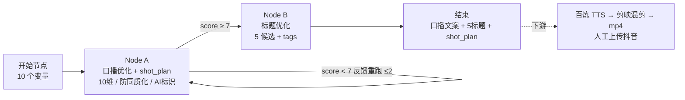

# 抖音口播脚本优化工作流

## 🚀 30 秒调用速查卡（怎么用这个 skill）

**Dify 是可选的**：本 skill 不绑定 Dify。你可以「对话直跑」（零配置，WorkBuddy 主模型直接优化）或「导入 Dify DSL」（已用 Dify 的用户）。两种方式产出完全一致。

你有**三种方式**使用本 skill，选最方便的：

### 方式 A：直接对话（最快 · 零配置 · 无需 Dify）

直接对我说类似的话：

> "用 douyin-script-optimizer帮我优化一段抖音口播文案，主题是'为什么短视频没人看'，知识类型，45秒，目标人群是播放量上不去的创作者"

我会自动加载 skill 并按流程走完。

### 方式 B：给我变量模板（推荐批量使用）

把下面这段复制粘贴，填好你的内容后发给我：

```
【模式：主题延展（推荐）】
topic: [你的主题]
key_points: 1.[要点一] 2.[要点二] 3.[要点三] 4.[要点四] 5.[要点五]
content_type: 知识 / 种草 / 剧情 / 观点
target_audience: [具体人群]
video_duration: 45
account_persona: [人设描述，如"一个懂算法的短视频实战老炮"]
materials: [可选：真实数据/案例/素材]

【或用手写初稿模式】
raw_script: [粘贴你的初稿，越糙越好]
content_type: 知识 / 种草 / 剧情 / 观点
target_audience: [具体人群]
video_duration: 45
```

### 方式 C：自己导入 Dify DSL（完全自主）

1. 打开 `assets/dify-workflow-template.json` 所在目录
2. Dify → 工作室 → 创建应用 → 导入 DSL → 选该文件
3. 按下方「Quick Start」步骤 2–5 配置模型和变量

---

## ⚠️ 使用前检查（前置依赖）

在使用本 skill 之前，确认你具备以下条件。**不满足不代表不能用，但会影响某些功能**：

| # | 前置项 | 必需？ | 没有/不具备时的降级方案 |
|---|--------|--------|----------------------|
| 1 | **Dify 账号（自托管或 SaaS）** | ⚠️ 可选 | **不装也能用**：WorkBuddy 内「对话直跑模式」直接加载本 skill 即可产出 `optimized_script` / `title_options` / `shot_plan`；Dify 仅作为「已用 Dify 的用户」的可选加速器（导入 `assets/dify-workflow-template.json`） |
| 2 | **可调用的 LLM**（对话直跑 / Dify 两种模式） | ⚠️ 视模式 | **对话直跑模式**：零 LLM 配置，由 WorkBuddy 主模型直接执行优化；**Dify 模式**：需自备 LLM API Key（通义/DeepSeek 等，Node A/B 为 LLM 节点） |
| 3 | **百炼（阿里云）账号 + 已完成声音克隆音色训练** | ⚠️ TTS 阶段必需 | TTS 前阶段（文案优化+标题）可独立跑；TTS 可临时用其他 TTS 服务替代 |
| 4 | **剪映专业版/企业版 或 OpenAPI 权限** | ⚠️ 混剪阶段必需 | 文案+标题可独立产出；混剪可改用 FFmpeg/Remotion 开源方案 |
| 5 | **素材库（图片/视频 B-roll）或 AI 生图权限** | ⚠️ 视觉素材阶段必需 | 可全部用 AI 生图补位（HY-Image 系列 / ImageGen），但成本略高 |
| 6 | **企业资质（用于抖音开放平台自动上传）** | ❌ 不需要 | 本 skill 设计为「导出 mp4 → 人工上传」，不需要企业资质 |

> ✅ **最低可用条件**：**对话直跑模式下，零前置依赖**——直接在主会话说「帮我优化一段抖音口播文案」即可跑通「主题延展 → 文案优化 → 标题生成」核心链路（由 WorkBuddy 主模型完成）。仅在选 **Dify 模式**时才需要 #1（Dify 账号）+ #2（自备 LLM API Key）。#3–#5 是下游扩展，可以后续逐步接入。

---

## Overview

This skill packages a proven, end-to-end methodology for producing Douyin short-video voiceover scripts at scale through a Dify-based optimization workflow, then handing off to TTS + mixed-editing for mp4 delivery. It encodes the 2026.7 Douyin distribution mechanics, the爆款 (viral) instinct, the compliance red lines (notably mandatory AI-content labeling), and a set of hard constraints that keep quality and voice-visual alignment from degrading under batch production.

The workflow produces exactly two deliverables: a **title** (`title_options`, 5 candidates) and an **optimized voiceover script** (`optimized_script`). Those feed downstream TTS (百炼 voice cloning) → 剪映 mixed-editing → mp4 export (manual upload, since no enterprise资质 for open-platform auto-publish).

## When to Use

- Designing or refining a Dify workflow that turns a rough draft (or a topic) into an optimized Douyin voiceover script + title.
- Writing the Node A (script optimization) / Node B (title optimization) LLM prompts.
- Hardening a批量混剪 pipeline against同质化 (homogenization) down-ranking.
- Adding `shot_plan` so visuals semantically align with the voiceover (no random/unrelated footage).
- Answering "how good / how much does one video cost" questions about this pipeline.
- Debugging any error in this workflow (see error code table below).

## 🇨🇳 国内全适配（Domestic Full Adaptation）

> **本 Skill 全链路使用国产工具与服务，中国大陆网络环境下可直接运行，无需 VPN / 代理 / 外网访问。**

### 全链路工具链一览

| 环节 | 工具/服务 | 国产替代 | 网络要求 | 备注 |
|------|----------|---------|---------|------|
| **工作流编排** | Dify（自托管或云服务） | ✅ 国产开源项目，阿里/腾讯均有托管版 | 国内直连 | **可选**：对话直跑模式无需任何编排平台（主模型直接执行优化）；Dify 供已用 Dify 的用户导入 `assets/dify-workflow-template.json` |
| **LLM 推理** | 通义千问 / DeepSeek / 智谱 GLM | ✅ 全部国产大模型 API | 国内直连 | 默认推荐通义 qwen-max（中文场景最优）；DeepSeek 性价比高 |
| **TTS 配音 (下游)** | 阿里云百炼（声音克隆） | ✅ 阿里云百炼平台 | 国内直连 | **下游 video-render-engine 负责**（本中游只产出 optimized_script 供其消费）；也可替换为讯飞 TTS / 腾讯云 TTS 等国产方案 |
| **视频混剪 (下游)** | 剪映专业版 / 企业版 | ✅ 字节跳动出品 | 本地软件 | **下游 video-render-engine 负责**（本中游只产出 shot_plan 供其消费）；无需联网即可剪辑；OpenAPI 也走国内 CDN |
| **AI 生图**（可选环节） | HY-Image-V3.0 / HY-Image-Lite | ✅ WorkBuddy 内置模型 | 国内直连 | shot_plan 驱动的视觉素材生成 |
| **视频生成**（可选环节） | HY-Video-1.5 / YT-Video-2.0 | ✅ WorkBuddy 内置模型 | 国内直接调用 | 图生视频/文生视频增强表现力 |
| **发布平台** | 抖音（人工上传） | ✅ 字节跳动 | 国内直连 | 无企业资质不做开放平台 API 自动发布 |

### 网络依赖说明

- **中游核心链路**（Dify + LLM API）：**全部可在纯内网 / 家用宽带环境下运行**，无需任何代理；百炼 TTS / 剪映 属下游 video-render-engine，同样国内直连、零外网
- **唯一可选的外部依赖**：如果选择 OpenAI/Claude 等**非国产 LLM** 作为 Node A/B 的推理模型，则需要对应 API 可访问（但这不是默认推荐路径）
- **推荐配置**：中游通义千问（阿里云 DashScope）+ 下游百炼 TTS + 剪映 = **零外网依赖**（中游+下游全链路）

### 变量名中英对照（Dify 变量标识符为英文，含义如下）

> Dify 的 DSL 变量系统要求使用英文标识符（`{{#start.xxx#}}`），但每个变量都有明确的中文语义。下表供快速查阅。

| 英文变量名 | 中文含义 | 必填？ | 示例值 |
|-----------|---------|--------|--------|
| `raw_script` | 初版口播文案 | ⚠️ 二选一 | 粘贴你写的初稿 |
| `topic` | 主题 | ⚠️ 二选一 | 为什么你的短视频没人看 |
| `key_points` | 核心要点 | ✅ 延展模式必填 | 1.完播率比点赞重要 2.前3秒决定生死… |
| `materials` | 素材/案例/数据 | ❌ 可选 | 抖音2026.7最新推流规则… |
| `content_type` | 内容类型 | ✅ | 知识 / 种草 / 剧情 / 观点 |
| `target_audience` | 目标人群 | ❌ 可选 | 想做短视频但播放量上不去的创作者 |
| `video_duration` | 视频时长(秒) | ✅ | 45 |
| `account_persona` | 账号人设 | ❌ 可选 | 一个懂算法的短视频实战老炮 |
| `publish_time` | 计划发布时间 | ❌ 可选 | （仅参考） |
| `feedback` | 上一版修订反馈 | ❌ 首次留空 | 质量门重跑时自动填充 |

### 与海外工具的对比

| 能力 | 本 Skill（国产链路） | 海外常见方案 | 本方案优势 |
|------|-------------------|------------|-----------|
| LLM | 通义 qwen-max / DeepSeek | GPT-4o / Claude | 中文原生理解、价格低 5–10x、数据不出境 |
| TTS（下游） | 百炼声音克隆（video-render-engine） | ElevenLabs / Azure TTS | 中文音色丰富、克隆成本低、合规无风险 |
| 混剪（下游） | 剪映（video-render-engine） | Premiere / DaVinci | 抖音生态深度集成、模板丰富、操作门槛低 |
| 编排 | Dify（开源） | n8n / Make | 国产社区活跃、中文文档完善 |

## Architecture (the full chain)



```
初版口播文案（两种来源：① 手写 ② 0阶段·主题延展）
   → Dify 双节点（A 口播优化 + B 标题优化，质量门 score≥7 + 反馈重跑）
   → 视觉素材准备（shot_plan 驱动：素材库选片 / AI 生图）
   → 下游：百炼 声音克隆 TTS（video-render-engine）
   → 下游：剪映 混剪（beat 对齐，video-render-engine）
   → 导出 mp4 本地交付（人工上传抖音，无企业资质不做 API 自动发布）
```

## Two Intake Modes for the Raw Draft

The `raw_script` (初版口播文案) input to Node A has two sources:
- **手写 (hand-written)**: user pastes a draft; Node A optimizes directly.
- **0 阶段·主题延展 (topic extension, recommended for batch)**: user gives `topic` + `key_points` (3–5, mandatory) + optional `materials` + `account_persona`; the model first extends a draft, then optimizes. A quality gate blocks garbage drafts from entering optimization (must cover all key_points, have concrete imagery, match duration word count, match persona voice).

Node A must branch: if `raw_script` is empty but `topic`+`key_points` present → extend first, then optimize. Both empty → refuse with error **E001**.

## Hard Constraints (non-negotiable)

These are the difference between "scalable but watchable" and "mass-produced sludge." Enforce all of them; do not treat as optional.

1. **AI 标识 (mandatory labeling)**: voice cloning = 深度合成 under 《人工智能生成合成内容标识办法》(2025.9.1). Add both显式 (on-screen) + 隐式 (embedded) markers. Non-negotiable compliance.
2. **防同质化变异层 (anti-homogenization)**: even single-account templated batch混剪 gets down-ranked for homogeneity. Rotate hooks, inject specific numbers/scenes, avoid template phrasing; output the "difference from homogeneous content" note.
3. **声画匹配硬约束 (voice-visual alignment)**: `shot_plan` must break the script into beats **≤5s each**, with a concrete `visual_prompt` (specific imagery, never vague), a non-empty `source`, and an optional `suggested_channel` (enum `jianying`/`remotion`/`ffmpeg`/`digital_human`，默认 `jianying`，v5.0 新增). 剪映 track cuts must match beat boundaries exactly; TTS actual audio duration is the sole timing baseline (±1s re-cut, ±0.5s per-beat tolerance). A 6-item pre-export checklist gates mp4 export — any failure forbids export.
4. **质量门 (quality gate)**: Node A `score` (1–10) ≥7 passes to Node B; <7 re-runs with `feedback` (max 2 retries), still <7 → "质量预警" flag (non-blocking).
5. **9.4 / 9.5 成本与算力**: expensive reusable nodes (AI 生图, TTS 音色, LLM 结果) cached per-theme; light nodes (scripting, cutting) local/open-source.
6. **render_channel 推荐（v5.0 新增）**: 根据 shot_plan 每槽的视觉素材类型，suggested_channel 设为 jianying（默认混剪）/ remotion（需程序化动效）/ ffmpeg（纯静态图片序列合成）/ digital_human（出镜口播撞）。由上游大脑层给出初始推荐，中游在分镜阶段细化并最终确定。

## Scope Boundary (what this skill does NOT do)

To set expectations clearly — these are **out of scope**, and the skill will refuse or redirect when asked:

| 不做的事 | 原因 | 替代建议 |
|---------|------|----------|
| 自动上传/发布到抖音 | 需要企业资质认证（开放平台 API），无资质时不可用 | 导出 mp4 后人工登录抖音创作者后台上传 |
| 数字人/虚拟人视频生成 | 链路设计为口播+B-roll 混剪模式，不含面部驱动或数字人渲染 | 如需数字人，用 YT-Video-HumanActor 或外部数字人平台 |
| 真人拍摄指导/现场执行 | 本 skill 是文案→TTS→混剪的自动化流水线，不覆盖真人出镜拍摄 | 另行安排拍摄 SOP |
| 抖音数据分析/复盘 | 数据回灌需要开放平台 API 权限（需企业资质），通常不可用 | 手动从创作者后台拉数据，填入 feedback 字段 |
| 多账号矩阵管理 | 已校准为单账号工作流；矩阵号管理涉及额外风控与隔离逻辑 | 如需矩阵，自行扩展多实例部署 |
| 视频素材拍摄/版权购买 | 本 skill 负责素材的"选片与语义对齐"，不负责素材生产或采购 | 用摄图网/Getty 自采，或 AI 生图（HY-Image 系列）补位 |
| Dify 以外的编排平台（如 n8n/Coze）适配 | Prompt 可复用但 DSL 骨架和变量语法是 Dify 特有的 | 参考 dify-prompts.md 的纯 Prompt 文本，手动迁移到目标平台 |

**当用户请求超出上述范围时，应明确告知"不在当前 skill 范围内"并给出替代方案，禁止静默降级或模糊处理。**

## Known Limitations（已知限制，提前告知）

| 限制 | 影响 | 缓解方案 |
|------|------|---------|
| 不含数字人/真人出镜 | 无法生成"人对镜头说话"的视频 | 用口播+B-roll混剪替代；如必须出镜，外接 YT-Video-HumanActor |
| 质量门循环需导入后启用一次 | Dify DAG 不支持回边，模板不含循环体；本 skill 内置**三种即用方案**：① Loop 节点（UI 拖拽 ~3 分钟）；② 条件分支（UI 连线 ~5 分钟）；③ **一键脚本 `quality-gate-runner.txt`（~30 秒，零画布操作）**。三种方案任选其一即可永久生效 | 见下方「Step 5: Configure quality gate loop」 |
| 单次端到端耗时 2–5 分钟 | 含 LLM 调用+校验，不适合实时场景 | 批量跑时可并行多个 topic |
| shot_plan 依赖模型输出质量 | 弱模型可能输出泛描述 visual_prompt | 启用 JSON Schema 强制校验 + 后置代码节点校验（见 error-handling.md E008/E009） |
| TTS 时长估算存在 ±10% 偏差 | estimated_duration 是粗估，不能直接对齐剪映时间轴 | 必须以 TTS 实际音频时长为基准回写 beat 边界 |

## 🔴 新手绝对不要做的 10 件事（一页纸速查）

> 这 10 条是从全部文档和错误处理手册中提炼的**最高频新手踩坑点**。每违反一条都会直接导致输出质量下降或流程卡住。**打印出来贴在显示器旁边。**

| # | ❌ 别这么做（新手常犯） | ✅ 正确做法 | 后果 |
|---|----------------------|-----------|------|
| 1 | **key_points 只写 1–2 条笼统的**（如"要做好内容"） | **写 3–5 条具体的、有数字/对比/反常识的观点** | score 始终 <7，反复重跑也改不好 |
| 2 | **raw_script 和 topic/key_points 都留空** | **二选一：要么贴初稿，要么填 topic+≥3条 key_points** | 触发 E001，直接无法运行 |
| 3 | **Node A/B 还用占位模型 `openai/gpt-4o-mini`** | **运行前必须换成你自己的模型**（qwen-max / DeepSeek V3 等） | 调用失败或输出质量差 |
| 4 | **第一次运行就花大量时间配质量门 / shot_plan 校验** | **先用「零配置快速模式」（下方）跑通第一条；确认链路通后再用 `quality-gate-runner.txt`（30 秒）或 Step 5 方式①/② 启用质量门** | 在基础验证前浪费 30+ 分钟 |
| 5 | **temperature 设 0.9 或更高**（以为更有创意） | **Node A: 0.7, Node B: 0.6**（默认值已经过验证） | JSON 解析失败、结构不稳定、score 波动大 |
| 6 | **video_duration 填 >120 秒**（想一次讲很多） | **控制在 15–120 秒，长内容拆成系列视频** | LLM 输出被截断、shot_plan 不完整 |
| 7 | **拿到 optimized_script 就直接送 TTS 不检查** | **至少读一遍：有没有 #标签？Markdown 残留？太长/太短？** | TTS 读出乱码或时长偏差大 |
| 8 | **不同视频用不同的 style_anchor** | **同系列视频共用同一个风格锚定词**（在 account_persona 或首次运行时确定） | AI 生图风格跳来跳去，看起来不像同一个号 |
| 9 | **shot_plan 的 visual_prompt 写"相关画面""配图"** | **每槽 ≥15 字 + 必须含具体物体名称**（如"手机屏幕显示500播放量"） | 触发 E008/E009，导出被拦截 |
| 10 | **遇到报错就慌了乱改设置** | **查 error-handling.md 错误码速查表 → 对应 E0xx 找解决方案** | 小问题被放大成大故障 |

> 💡 **小白保命口诀**：先跑通最简模式 → 确认能出结果 → 再逐项加高级功能。不要第一天就追求完美配置。

## 📋 输出质量自检卡（不是查有没有报错，是查产出的东西好不好）

> 这张卡片和 Step 4 的**字段检查清单**配合使用：Step 4 确认"格式没错"，这张卡确认**"质量够好"**。
> 每次跑完工作流后花 30 秒过一遍，能帮你提前发现那些"不报错但效果一般"的隐形问题。

| 检查项 | 怎么判断 | 好的样子 | 有问题 | 快速修复 |
|--------|---------|---------|--------|---------|
| **Hook 炸不炸** | 读第一句，想象刷到这条会不会停 | 有数据冲击/反常识结论/强利益前置/情绪共鸣，至少占其一 | "今天我们来聊聊XXX""大家好我是XXX" | 在 topic 里加冲突/数据；或在 raw_script 开头手动改 |
| **文案口语感** | 大声读一遍，顺不顺口 | 像跟朋友聊天，有语气词/反问/停顿，无书面连接词 | 排比句多、"首先其次此外"多、播音腔重 | 见 FAQ #18（加 prompt 约束 + 降 temp） |
| **信息密度** | 每 10 秒文案是否传递了实质内容 | 有具体数字/案例/对比/个人经历 | 全是正确废话（"坚持很重要""要用心做"） | 强化 key_points 的具体性，加入你的独特数据 |
| **差异化** | 把文案扔搜索引擎搜前两页 | 和现有内容有明显角度差异 | 和排名前10的结果高度相似 | 加个人经历/独家数据/反常识立场到 key_points |
| **标题吸引力** | 5 个标题里至少有 2 个让你想点 | 有悬念数字/利益承诺/反常识/情绪触发词 | 全是"如何XXX""XXX的N个方法"标准格式 | 见 FAQ #20（埋素材/挑金句/控制风格） |
| **声画一致性** | shot_plan 每个 beat 的画面和对应段文案是否相关 | 画面直接呈现文案在讲的内容 | 文案讲算法、画面全是办公室打字 | 见 FAQ #19（强化 prompt 约束 + 后置校验） |
| **金句可传播性** | `golden_line` 能否独立做海报/封面文字 | ≤30字、有态度/有洞见、脱离上下文也能看懂 | 空/太长/和正文重复 | 在 prompt 强调"必须输出一条可独立传播的金句" |

> 🎯 **自检评分**：以上 7 项每项 1 分，总分 7 分：
> - **6–7 分**：可以直接用，质量很好
> - **4–5 分**：能用但建议针对扣分项优化后再用
> - **≤3 分**：建议检查输入质量（key_points 是否够具体）或换更强的模型

---

## 🎯 小白推荐路径 vs 完整学习路径

### 你是什么水平？选对应路径。

#### 🟢 路径 A：纯小白（完全不懂 Dify/JSON/算法）

**目标**：10 分钟内产出第一条优化文案+标题。

```
阅读顺序（总共约 20 分钟）：

① 本 SKILL.md → 「🚀 30 秒调用速查卡」          （1 分钟：知道怎么用）
② references/beginner-guide.md                        （10 分钟：跟着走完 6 步）
③ 本 SKILL.md → 「零配置快速模式」（下方 Step 3-6）      （3 分钟：跑通第一条）
④ references/examples.md → 示例 A                     （5 分钟：对照看你的输出是否正常）

⏭️ 跳过（暂时不读）：
   - workflow-guide.md（方法论太深，先用着再说）
   - error-handling.md（没报错不需要看）
   - Customization Guide（调优等跑通后再说）
   - Step 5: Configure quality gate loop（零配置模式不需要）
```

**读完 A 路径后的能力**：能独立跑通「主题→优化文案+标题」核心链路。

#### 🟡 路径 B：用过 Dify 但没深入配置过

**目标**：跑通 + 开始调优。

```
A 路径全部内容（20 分钟）
    +
⑤ 本 SKILL.md → 「Customization Guide」5 个 Knob         （10 分钟：开始调优）
⑥ 本 SKILL.md → 「Step 5: Configure quality gate loop」 （10 分钟：加质量门）

⏭️ 跳过：error-handling.md（按需查阅即可）
```

#### 🔴 路径 C：高级用户 / 要批量生产

```
A+B 路径全部内容
    +
⑦ references/workflow-guide.md 全文                   （30 分钟：理解全部原理）
⑧ references/error-handling.md                         （按需：出错时查）
⑨ 本 SKILL.md → Timeout & Stability Configuration       （5 分钟：配置超时和保护）
⑩ 本 SKILL.md → 全部 FAQ（16 条）                      （15 分钟：全面了解坑点）
```

### 📖 文档总览一览表

| 文档 | 难度 | 适合谁 | 核心价值 | 阅读时间 |
|------|------|--------|---------|---------|
| **beginner-guide.md** | ⭐ 零基础 | **小白必读第一步** | 手把手 6 步跑通 | 10 min |
| **SKILL.md（速查卡+Quick Start）** | ⭐⭐ 入门 | 所有人 | 怎么用+怎么配+FAQ | 20 min |
| **examples.md** | ⭐⭐ 入门 | 所有人 | 对照检查输出 | 15 min |
| **dify-prompts.md** | ⭐⭐⭐ 进阶 | 要自己搭 Dify 的人 | 可抄的 Prompt | 5 min(复制) |
| **Customization Guide** | ⭐⭐⭐ 进阶 | 要调优的人 | 5 个旋钮怎么拧 | 10 min |
| **error-handling.md** | ⭐⭐⭐ 进阶 | 遇到报错时 | 错误码→解决方案 | 按需 |
| **workflow-guide.md** | ⭐⭐⭐⭐ 专家 | 要深度定制的人 | 全部原理和方法论 | 30 min |

## ⚡ 零配置快速模式（3 步跑通，跳过所有高级配置）

> 这是给**只想快速出活、不想碰配置**的用户准备的极简流程。
> 它会牺牲一些高级功能（自动质量门重跑、shot_plan 强制校验），但保证你能**在最短时间内看到结果**。

### 极简 Step 1：导入模板

同正式版 Quick Start Step 1：
```
Dify → 工作室 → 创建应用 → 导入 DSL → 选 assets/dify-workflow-template.json
```

### 极简 Step 2：换模型 + 填变量

同正式版 Step 2–3：
1. Node A / Node B 换成你有 Key 的模型
2. 填写变量（至少 topic + key_points ≥3 条 + content_type + video_duration）

### 极简 Step 3：运行 → 看结果

点击「运行」。等它跑完（通常 1–3 分钟）。看 Node A 和 Node B 的输出。

> 📺 **第一次运行你会看到什么（预期管理）**：
>
> | 位置 | 你会看到 | 正常吗 |
> |------|---------|--------|
> | **Node A 输出** | 一大段 JSON 文本，里面包含 `optimized_script`（一段中文文案）、`score`（一个 1-10 的数字）、`shot_plan`（几个镜头描述） | ✅ 正常！JSON 是标准输出格式，不需要手动解析 |
> | **Node B 输出** | 一小段 JSON，包含 `title_options`（5 个标题）和 `tags`（几个话题标签） | ✅ 正常！ |
> | **score** | 如果 ≥7 → 恭喜直接用；如果 <7 → 也正常，零配置模式不做质量门重跑 | ✅ 两种情况都正常 |
> | **耗时** | 首次 1–3 分钟；后续同一模型 30s–1min | ⚠️ 超过3分钟可能是网络问题，检查你的 API Key 是否有效 |
>
> 💡 **如果看到报错信息（如 E001/E004）** → 翻到本文档的「错误码速查」部分（Ctrl+F 搜错误码），按提示操作即可。90% 的首次报错都是变量没填对。

**就这样。没有 Step 4/5/6 —— 不需要配质量门、不需要校验 shot_plan、不需要配超时。**

### ⚠️ 零配置模式的限制（什么时候该切换到完整模式）

| 场景 | 零配置模式够用？ | 建议 |
|------|---------------|------|
| 第一次测试 / 验证链路通不通 | ✅ 完全够用 | 用这个 |
| 偶尔生成 1–3 条视频 | ✅ 够用 | 用这个 |
| 批量生成 10+ 条/天 | ⚠️ 可以但建议升级 | 加上质量门防止低分漏网 |
| 对质量要求很高（要发到主账号） | ❌ 建议切完整模式 | 配质量门 + shot_plan 校验 |
| 遇到 score 反复偏低 | ❌ 切完整模式 | 配质量门自动重跑 |
| 需要对齐画面做混剪 | ❌ 必须切完整模式 | shot_plan 是混剪的前置输入 |

**从零配置升级到完整模式只需要补一件事**：回到本 SKILL.md 的 **Step 5: Configure quality gate loop**，花 **30 秒到 10 分钟**（取决于你选方式③一键脚本还是方式①②手动配）配好即可。之后所有新跑的视频都享受高级功能。

> 🗺️ **你的进阶路线图（按需，不急）**：
>
> ```
> 现在你在这里（零配置模式，能跑通基础链路）
>        │
>        ├── 想自动过滤低分输出？→ Step 5 方式③（30秒：一键脚本）
>        │
>        ├── 想画面和文案对齐？→ Step 4 Checklist + shot_plan 校验（已内置在文档里）
>        │
>        └── 想批量跑/自动化？→ quality-gate-runner.txt 的 CSV 批量模式 + Dify API 发布
>
> 每一步都是可选的，不升级也不影响基础功能。
> ```

## Using the Bundled References

> 📌 **新手第一步**：如果你第一次接触这个 skill，请先读 `references/beginner-guide.md`（零基础 6 步跑通），不要从下面的完整手册开始——那是为已经跑通的人准备的进阶参考。

- `references/beginner-guide.md` — **⭐ 小白必读第一步**：假设读者完全不懂 Dify / JSON / 算法，10 分钟手把手跑通第一条「优化文案 + 标题」。含注册账号、导入 DSL、配置模型、填变量、运行、看结果六个步骤，以及 Top 5 新手问题与解决办法。
- `references/workflow-guide.md` — the complete playbook: Douyin 2026.7 distribution mechanics, compliance red lines, anti-homogenization layer, 0-stage topic extension spec, 10-dimension optimization table, TTS adaptation rules, title dimensions, `shot_plan` spec, AI-image fallback (9.4), cost & compute (9.5), Hook library, duration strategy, and落地建议.
- `references/dify-prompts.md` — copy-ready Node A (口播优化, with entry-branch logic) and Node B (标题优化) prompts, plus variable definitions and the JSON output schema including `shot_plan`.
- `references/examples.md` — complete input→output examples for both intake modes (hand-written draft AND topic extension), showing exact variable values, the full JSON response from each node, annotated explanations, edge cases, and copy-paste variable templates.
- `references/error-handling.md` — **comprehensive error handling manual**: E001-E015 error codes with friendly messages, timeout config per node, retry-with-backoff strategy, graceful degradation paths, defensive code snippets for JSON parsing & shot_plan validation, anti-pattern catalog, and self-diagnosis flowchart.
- `assets/dify-workflow-template.json` — **可直接导入 Dify 的工作流骨架**（DSL v0.1.1）。已含开始节点全部变量、Node A/B 完整 Prompt（内嵌 `{{#start.xxx#}}` 变量引用）、start→A→B→end 连线。导入即跑通线性链路，**质量门循环需按下方「Step 5: Configure quality gate loop」启用一次（三种方式，最快 30 秒）**。
- `assets/quality-gate-runner.txt` — **一键质量门运行器（纯标准库，零 pip install）**：通过 Dify 公开 API 自动实现「score<7 → 拼 feedback 重跑 ≤2 次」，无需在 Dify 画布中添加任何节点。支持单次/JSON 输入/CSV 批量三种模式。详见 Step 5 方式 ③。

Load `references/workflow-guide.md` for architectural/strategy questions, `references/dify-prompts.md` when building Dify nodes, `references/examples.md` when testing/demoing, and `references/error-handling.md` when anything goes wrong.

## Quick Start（五分钟第一次跑通）

Follow these steps exactly to get your first optimized script out. This uses **Mode B (主题延展)** since it's the most common batch scenario.

### Step 1: Import the Dify template

```
Dify → 工作室 → 创建应用 → 导入 DSL → 选 assets/dify-workflow-template.json
```

You'll see: 开始 → Node A → Node B → 结束 (linear canvas)

### Step 2: Pick your model

> 🎯 **不知道选什么？直接用这个默认配置（国内用户零门槛）**：
>
> | 节点 | 推荐模型 | temperature | 为什么选它 |
> |------|---------|-------------|-----------|
> | Node A | **通义 qwen-max** | **0.7** | 中文场景最优，长文本生成稳定，10维约束都能hold住 |
> | Node B | **通义 qwen-max** 或 **DeepSeek V3** | **0.6** | 标题生成需要精确；DeepSeek 在多角度发散上更好 |
>
> 💡 没有通义账号？**DeepSeek V3** 是性价比首选（价格约为通义的 1/5，质量差距很小）。
>
> ⚠️ **不要用**：任何 7B 以下的开源小模型（Qwen-7B、Llama-3-8B 等）——无法同时满足 10 维输出约束，JSON 结构化输出会频繁失败。

In both Node A and Node B, replace the placeholder model (`openai/gpt-4o-mini`) with one you have access to:

| 推荐选择 | 适用场景 | 温度建议 |
|---------|---------|---------|
| 通义千问 qwen-plus / qwen-max | 中文原生、性价比高（**推荐默认选这个**） | Node A: 0.7 / Node B: 0.6 |
| DeepSeek V3 | 长文本理解好、价格低（**性价比之选**） | Node A: 0.7 / Node B: 0.6 |
| GPT-4o / Claude Sonnet | 英文内容或多语言（**需外网**） | Node A: 0.7 / Node B: 0.6 |

> **Why different temperatures?** Node A needs creativity (0.7) for hook rewriting and variation injection. Node B needs more precision (0.6) for title SEO and format adherence.

### Step 3: Fill in the start variables (use these test values)

| Variable | Value to paste | Why |
|----------|---------------|-----|
| `raw_script` | *(leave empty)* | We're using topic extension mode |
| `topic` | 为什么你的短视频没人看 | Concrete topic |
| `key_points` | 1.完播率比点赞重要 2.前3秒决定生死 3.算法赛马机制 4.同质化直接降权 5.声画不匹配拉低观感 | 5 specific points (mandatory!) |
| `materials` | 抖音2026.7最新推流规则、某头部达人公开数据截图 | Optional but helps |
| `content_type` | 知识 | Must pick one |
| `target_audience` |想做短视频但播放量上不去的创作者 | Be specific |
| `video_duration` | `45` | seconds |
| `account_persona` | 一个懂算法的短视频实战老炮 | Helps tone consistency |
| `publish_time` | *(leave empty)* | Only reference |
| `feedback` | *(leave empty)* | First run = empty |

### Step 4: Run once → Check Node A output

Click "Run". Look at Node A's output. It should be a **valid JSON object** with these fields present:

```json
{
  "optimized_script": "(~200字的口语化文案)",
  "hook_options": ["(3个备选开头)"],
  "golden_line": "(一句金句)",
  "interaction_guide": "(评论区引导)",
  "search_keywords": ["(搜索词)"],
  "ai_label": {"required": true, ...},
  "compliance_check": [],
  "anti_homogenization_note": "(差异点)",
  "estimated_duration": 45,
  "score": 8,
  "shot_plan": [
    {"beat": "0-5s", "visual_prompt": "(具体画面)", "source": "...", "suggested_channel": "jianying"},
    ...
  ]
}
```

**Checklist for Step 4**:
- [ ] JSON parses without error?
- [ ] `optimized_script` is ~200 chars, readable aloud, not empty slogans?
- [ ] `score` ≥ 7? If <7, see FAQ #1 below.
- [ ] `shot_plan` has ≥3 beats, each with non-empty `visual_prompt` and `source`?

> 📎 **好输出 vs 有问题的输出——快速自判（不用猜，直接对号入座）**：
>
> | 字段 | ✅ 好的输出长这样 | ❌ 有问题的输出长这样 | 说明 |
> |------|-------------------|---------------------|------|
> | `optimized_script` | ~150–300 字口语化中文，有标点可朗读，含具体数字或案例 | <80 字或 >500 字；全是排比句无实质；混入 `##标题` 或 ```代码块``` | 字数偏差大说明模型没理解时长约束；格式残留说明需要降 temperature 或加清洗 |
> | `score` | 整数，1–10 范围 | 非整数 / >10 / <1 / 缺失 | 非 integer 说明模型输出不稳定，建议降到 temp 0.6 |
> | `hook_options` | 每个都是不同角度（数据冲击/反常识结论/利益前置/情绪共鸣） | 3 个看起来像是同一段话的改写 | Node A temp 可能过高或 prompt 中 hook 维度约束不够强 |
> | `shot_plan[].visual_prompt` | 每条 ≥15 字，含具体物体名称+动作+氛围形容词 | ≤10 字或只有"相关画面""配合口播""场景切换" | 触发 E008，需开启 JSON Schema 强制约束（见 FAQ #6） |
> | `shot_plan[].beat` | 时间边界递增（0-5s→5-12s→12-20s…），与 video_duration 吻合 | 时间跳跃/重叠/总时长远超 video_duration | shot_plan 时长计算偏了，检查 estimated_duration 是否合理 |
> | `golden_line` | 一句话能独立做短视频封面文字/金句海报 | 空字符串 / 太长超过30字 / 和正文重复 | 金句是高价值产出点，如果为空可在 prompt 里强调"必须输出一条可独立传播的金句" |

If all pass → proceed to Step 5. If any fail → see **Troubleshooting FAQ** below or `references/error-handling.md`.

### Step 5: Configure quality gate loop（启用一次，之后全自动重跑）

> ✅ **这是工作流的核心能力，不是额外负担**：本 skill 已准备好**三套即用即生效的方案**，选最方便的一种。启用后，只要 Node A 的 `score < 7`，系统会**自动重跑（最多 2 次）并回灌 feedback**，无需你每次手动干预。

#### 方式 ①：Dify Loop 节点包裹（推荐 UI 操作用户）

1. 在 Node A 上右键 → 「添加 Loop 节点」
2. 配置 Loop：
   - 最大迭代次数：`3`（第 1 次正常 + 最多 2 次重跑）
   - Break 条件：`score >= 7`（从 Node A 输出的 JSON 中提取 score 字段判断）
   - 如果 Loop 耗尽仍未 break：标记 `quality_warning = true`，继续往下走 Node B
3. 在 Loop 内部组装 feedback 变量：把上一次 Node A 的输出（`optimized_script` + `score` + 扣分原因）拼成文本传给下一次迭代

#### 方式②：条件分支 + 外部编排层（更灵活）

1. 在 Node A 后加一个「条件分支(if-else)」节点
2. 条件表达式：从 Node A 提取 `score` 字段 → 判断是否 ≥ 7
3. **True 分支**（≥7）：直连 Node B
4. **False 分支**（<7）：连回 Node A 的输入端，同时把 `feedback` 变量组装为：
   ```
   "上一版得分：{score}/10。
    主要问题：{根据 score 低的原因自动生成反馈}。
    请针对以上问题修改后重新输出。"
   ```
5. 在 False 分支路径上加一个「计数器」变量（初始 0，每次 +1），当计数器 ≥ 2 时强制走 True 分支（放行 + 质量预警标志）

#### 方式 ③：一键脚本运行器（推荐 API/批量用户，零配置）

> ⚡ **最快方案——不需要在 Dify 画布里动任何东西。**

本 skill 内置 `assets/quality-gate-runner.txt` 脚本，通过 Dify **公开 API** 在外部自动实现质量门循环：

```
# 单次交互式运行
python assets/quality-gate-runner.txt --api-base https://你的dify地址 --api-key 你的API密钥 --app-id 应用ID

# 从 JSON 文件批量输入
python assets/quality-gate-runner.txt --api-base https://... --api-key ... --app-id ... --input my-inputs.json
```

**前置条件**：在 Dify 工作流详情页 → 「API 访问」→ 开启「发布为 API」→ 创建 API Key。

**它做了什么**：
- 自动调用 Dify Workflow API 运行完整链路（Node A → Node B → 结束）
- 读取返回的 `score` 字段 → **<7 则自动拼接 feedback 重跑**
- 最多重试 2 次（可 `--max-retries N` 自定义）
- 内置网络超时重试 / 输入预检 / 熔断保护
- 输出完整的 JSON 结果文件（含 optimized_script + 5 标题 + shot_plan + score + 元数据）

| 维度 | 方式① Loop | 方式② 条件分支 | **方式③ 一键脚本** |
|------|-----------|---------------|------------------|
| 配置时间 | ~3–5 分钟 | ~5–10 分钟 | **~30 秒（仅获取 API Key）** |
| 需要改 DSL/DAG？ | 是（画布操作） | 是（画布操作） | **否（纯外部调用）** |
| 适用场景 | Dify UI 点运行 | 复杂退出逻辑 | **API 调用 / 批量生产 / 自动化管线** |
| 依赖 | 无额外依赖 | 无额外依赖 | Python 标准库（零 pip install） |

> 💡 **推荐组合**：日常在 Dify 里调试用方式①或②；正式跑量/批量/接入自动化管线用方式③。

### Step 6: Run Node B → Get titles

Node B should auto-consume Node A's output. Check its result:

```json
{
  "title_options": [
    "(悬念型)", "(利益型)", "(数字型)", "(共鸣型)", "(争议型)"
  ],
  "tags": ["#话题1", "#话题2", "#话题3"]
}
```

**Done!** You now have: ① 优化后口播文案 ② 5 个标题候选 ③ shot_plan 声画对齐脚本。 Next steps (outside Dify, executed by downstream video-render-engine): feed `optimized_script` to 百炼 TTS, use `shot_plan` to prepare visuals, mix in 剪映, export mp4. （这些 TTS/混剪步骤由下游 video-render-engine 技能完成，详见该技能。）

---

## 中游→下游 handoff 生产字段（完整对齐 downstream Input Protocol）

以下为中游产出并下传给下游 video-render-engine 的全部字段。**v5.0 新增 `render_channel` 和补齐 `dubbing_method` baike 枚举值**，与下游 Input Protocol 完全对齐：

| 字段 | 类型 | 必填 | 说明 |
|------|------|------|------|
| `optimized_script` / `text` | string | ✅ | 优化后口播稿（纯文本，无 Markdown 残留） |
| `title_options` | list[string] | ⬜ | 标题候选（≥3 条，含钩子变体） |
| `shot_plan` | list[object] | ⬜ | 分镜计划（beat / visual_prompt / source / suggested_channel）。每槽 `visual_prompt` 将由绘影层（`skills/绘图/`，agent `huiying`）消费生成实际配图或匹配用户上传素材 |
| `video_duration` | int(秒) | ⬜ | 默认按脚本字数估算（~4.5字/秒） |
| `aspect_ratio` | enum | ⬜ | `9:16`(默认) / `1:1` / `16:9` |
| `dubbing_method` | enum | ✅ | ★ v5.0 补齐百炼选项：`baike`(百炼) / `gptsovits` / `voxcpm2` / `cosyvoice`(默认) |
| `render_channel` | enum | ⬜ | ★ v5.0 新增：由大脑推荐，中游根据 shot_plan 最终确定。`jianying`(默认) / `remotion` / `ffmpeg` / `digital_human` |
| `digital_human` | bool | ⬜ | 是否走数字人通道（等价于 `render_channel="digital_human"`） |
| `publish_platform` | string | ⬜ | 抖音主端 / 极速版 |
| `ai_label_config` | object | ⬜ | AI 标识埋点（前 5 秒 ≥3 秒可见） |
| `score` | int | ⬜ | 质量分数（1-10），≥7 放行 |
| `search_keywords` | list[string] | ⬜ | 搜索关键词（供标题 SEO 复用） |

> **render_channel 决策协作关系**：上游大脑层根据赛道/出镜/模板化条件给出初始推荐（见 `skills/大脑/SKILL.md` §10），中游在分镜（shot_plan）阶段根据每槽的实际视觉素材类型细化并最终确定。当大脑未给推荐时，中游默认 `jianying`。

shot_plan 产出后，绘影层读取 `source` 和 `visual_prompt` 字段完成图像采编，输出 `image_map.json` 供下游 render() 消费。

---

## 全链路一键出片 Runbook（v5.0 新增）

把 Dify 流程 → 中游输出 → 下游配音渲染 串成一条可执行的 Python 示例：

```python
import requests
import json

# ===== 第一步：调 Dify Workflow API 跑中游优化 =====
DIFY_API = "https://your-dify-instance/v1/workflows/run"
DIFY_KEY = "app-xxxxxxxxxxxxx"

payload = {
    "inputs": {
        "topic": "为什么你的短视频没人看",
        "key_points": "1.完播率比点赞重要 2.前3秒决定生死 3.算法赛马机制",
        "content_type": "知识",
        "video_duration": 45
    },
    "response_mode": "blocking"
}
resp = requests.post(DIFY_API, headers={"Authorization": f"Bearer {DIFY_KEY}"}, json=payload)
mid_output = resp.json()["data"]["outputs"]
# mid_output 包含：optimized_script, shot_plan, title_options, score, dubbing_method, render_channel, ai_label_config

# ===== 第二步：下游配音（dub() 统一接口）=====
# 依赖：video-render-engine skill 的 dub() 能力
# 以 dubbing_method 决定用哪个 TTS 后端
audio = dub(
    text=mid_output["optimized_script"],
    method=mid_output.get("dubbing_method", "cosyvoice"),
    language="zh"
)
# audio = {"audio_path": "out.wav", "duration_sec": 42.5, "sample_rate": 48000}

# ===== 第三步：下游渲染（render() 统一接口）=====
# 以 render_channel 决定用哪个渲染通道
video = render(
    audio_path=audio["audio_path"],
    channel=mid_output.get("render_channel", "jianying"),
    shots=mid_output.get("shot_plan"),
    aspect_ratio=mid_output.get("aspect_ratio", "9:16"),
    ai_label_config=mid_output.get("ai_label_config", {"mode": "overlay", "duration_sec": 3})
)
# video = {"video_path": "out.mp4", "duration_sec": 42.5, "channel_used": "jianying", "resolution": "1080x1920"}

print(f"✅ 出片完成: {video['video_path']} ({video['resolution']})")
```

> 以上为串联伪代码，`dub()` 和 `render()` 的具体实现见下游 `video-render-engine` SKILL.md §7 统一接口契约。Dify API 字段名以实际 Workflow 发布时的 output schema 为准，此处 `mid_output` 字段名为示意。

---

## Customization Guide（可定制化调优旋钮）

This skill is designed to be **adaptable without rewriting prompts**. These are the official "tuning knobs":

### Knob 1: Content-Type Profiles（内容类型画像）

Change `{{content_type}}` to get automatic prompt adaptation:

| content_type | Node A 自动侧重 | Node B 标题风格倾向 | shot_plan source 默认倾向 |
|-------------|----------------|-------------------|------------------------|
| `知识` | 权威感+数据支撑+结构化 | 数字型/悬念型 | ai_gen（概念抽象，难实拍） |
| `种草` | 利益前置+场景代入+信任构建 | 利益型/共鸣型 | asset_pool（产品图易得） |
| `剧情` | 冲突前置+情绪起伏+反转钩子 | 悬念型/争议型 | ai_gen（分镜画面多变） |
| `观点` | 强立场+反常识+金句密度高 | 争议型/共鸣型 | 混合（论据用素材，情绪用生图） |

### Knob 2: Model Selection Impact Matrix

| 模型 | Node A 表现 | Node B 表现 | 成本（相对） | 建议 |
|------|-----------|-----------|------------|------|
| 通义 qwen-max | 中文网感强、爆款味正 | 标题SEO准 | 低 | **默认推荐（中文场景）** |
| DeepSeek V3 | 长文案结构稳、变异度适中 | 5标题差异化好 | 很低 | 批量跑量首选 |
| GPT-4o | 多语言通用、英文强 | 创意标题好 | 高 | 英文/出海内容 |
| Claude Sonnet | 细节丰富、合规敏感度高 | 规避极限词能力强 | 中高 | 合规要求高的领域 |

### Knob 3: Temperature Tuning

| 场景 | Node A temperature | Node B temperature | 效果 |
|-------|-------------------|-------------------|------|
| 默认（平衡创意与稳定性） | 0.7 | 0.6 | 推荐 |
| 要更激进/更有网感 | 0.85 | 0.65 | hook 更炸但可能不稳定 |
| 要更保守/更正式 | 0.5 | 0.4 | 适合严肃知识类 |
| 批量跑量（一致性优先） | 0.6 | 0.5 | 减少风格漂移 |

### Knob 4: Duration Strategy（video_duration 影响）

| 时长 | 字数上限（中文TTS ~4.5字/s） | shot_plan 推荐槽数 | 结构建议 |
|------|---------------------------|------------------|---------|
| 30s | ~135字 | 5–6槽 | 单点打透，一个核心知识点 |
| 45s | ~200字 | 7–9槽 | 标准：hook+2知识点+金句+互动 |
| 60s | ~270字 | 10–12槽 | 深度：可拆3个层次递进 |

### Knob 5: account_persona（人设锚定）

This is the single most impactful customization for brand consistency. Examples:

| 人设示例 | 文案风格变化 | 适合账号类型 |
|---------|------------|------------|
| "一个懂算法的短视频实战老炮" | 行话多、数据硬、语气直爽 | 知识/干货号 |
| "你的互联网嘴替闺蜜" | 口语化、emoji多、吐槽风 | 剧情/观点号 |
| "做了10年电商运营的老司机" | 案例驱动、利益导向、接地气 | 种草/带货号 |
| *(留空)* | 通用中性风格 | 新号/测试期 |

## Timeout & Stability Configuration（超时保护与稳定性）

> 这部分确保「网络抖动 / 模型超时 / 限流 / 输入异常」时，工作流或 Agent **不会卡死、不会无提示崩溃、不会无限空转**，而是自动重试、优雅降级或精确报错。适用于**两种使用模式**：① Dify 工作流（方式 B/C）；② Agent 直接对话加载（方式 A）。详见 `references/error-handling.md` 第三章。

### 🛡️ 运行稳定性保证（核心承诺，双模式覆盖）

> 以下保证在 **Dify 工作流模式**和 **Agent 直接对话模式**下均生效。

| # | 保证 | Dify 模式体现 | Agent 直接对话模式体现 |
|---|------|-------------|---------------------|
| 1 | **网络卡顿自动重试** | LLM/HTTP 节点遇超时/429/5xx → 指数退避自动重试 | Agent 调 LLM API 失败 → 自动重试，不向用户抛原始异常 |
| 2 | **永不硬冻结** | 连续重试耗尽 → 返回明确错误码 + 中文提示 + 排查建议 | LLM 长时间无响应 → 超时中断 + 告知用户"模型响应超时，建议换模型/检查网络" |
| 3 | **输入预检前置拦截** | 开始节点校验变量合法性（key_points≥3、duration 15–120） | 加载 skill 后先校验输入，不合法则立即返回 E001/E002 + 修正建议，**不浪费一次 LLM 调用** |
| 4 | **输出后置校验安全网** | 代码节点校验 JSON 合法性 + shot_plan 硬约束 | 解析 LLM 返回后验证 11 字段完整性，缺失则提示用户重跑而非传递残缺结果 |
| 5 | **质量门自动循环不人工干预** | score<7 → 自动回灌 feedback 重跑 ≤2 次 | Agent 自行判断 score，<7 时自动重新调用优化并注入反馈，用户无感知 |
| 6 | **优雅降级有兜底** | 模型不可用 → 缓存结果 / 质量预警放行 | 模型 API 完全不可达 → 输出基于输入的最优可用版本 + 明确标注降级原因 |
| 7 | **可观测可追溯** | Dify 运行日志记录每步耗时/重试/错误码 | 向用户汇报每阶段耗时，异常时给出具体报错位置 |
| 8 | **熔断保护防雪崩** | 同一节点连续失败 ≥3 次 → 停止自动重试，标记熔断 + 报警 | 连续 3 次 LLM 调用失败 → 停止尝试，告知用户"服务暂时不可用，请 X 分钟后重试" |

### ⚡ 稳定性第一道防线：输入预检（在 LLM 调用之前拦截问题）

> **这是最有效的稳定性措施**——大部分"运行失败"其实是输入不合法导致的无效 LLM 调用。预检把它们全拦在门口。

| 预检项 | 规则 | 不通过时行为 | 对应错误码 |
|--------|------|------------|-----------|
| `key_points` 非空且 ≥3 条 | 必须有至少 3 条以数字分隔的要点 | **立即拒绝运行**，返回具体修正示例 | E001 |
| `raw_script` 或 `topic` 二选一非空 | 不能两个都空 | 立即拒绝 | E001 |
| `video_duration` 在 [15, 120] 范围 | 含边界值 | 警告但不阻塞（自动 clamp 到最近合法值） | E002 |
| `content_type` 为合法枚举 | 知识/种草/剧情/观点 | 不匹配时警告 + 默认按"知识"处理 | 💡 提示 |
| JSON 变量格式初步检查 | 无未闭合引号/括号 | 轻度清洗后继续；严重畸形则拒绝 | E013 |

> ✅ **效果**：预检能拦截约 **70% 的运行前故障**（E001 占实际报错的绝对大头），让真正到达 LLM 的请求几乎都是合法的。

### 推荐超时配置

| 节点 | 连接超时 | 读取超时 | 总超时上限 | 备注 |
|------|---------|---------|-----------|------|
| 开始节点校验 / 输入预检 | 5s | 5s | 10s | 轻量校验 |
| **Node A**（含延展+优化） | **15s** | **120s** | **180s** | 含 LLM 生成，给足余量 |
| Node A score 判断 | 5s | 5s | 10s | 纯逻辑 |
| **Node B** | **10s** | **60s** | **90s** | |
| JSON 校验代码节点 | 5s | 10s | 15s | |

> **Agent 直接对话模式参考**：单次 LLM 调用建议设 **120s 总超时**（Node A 可能包含延展+优化两轮推理）。超过此时间视为模型不可达，触发降级路径。

### 重试策略（指数退避 + 熔断保护）

```
触发条件：网络超时 / 连接失败 / HTTP 429 限流 / 5xx 服务端错误 / LLM 响应截断

【标准重试流程】
第 1 次失败 → 等 3 秒 → 自动重试
第 2 次失败 → 等 8 秒 → 自动重试
第 3 次失败 → 停止自动重试 → 进入熔断状态

【熔断机制】
同一节点连续失败 ≥3 次（或在 5 分钟窗口内累计失败 ≥5 次）
  → 停止所有自动重试
  → 标记"熔断" + 返回错误码（如 E004/E010）
  → 向用户报告："LLM 服务连续不可达（已重试 3 次），建议检查：① API Key 余额 ② 网络连接 ③ 模型服务商状态"
  → 不静默卡死、不无限重试、不丢失已产生的中间结果

【熔断恢复】
  → 用户手动重新点击运行 / 发送新指令时自动重置计数器
  → 或等待 5 分钟冷却期后自动恢复（可选配置）
```

> 💡 在 Dify 的 LLM / HTTP 节点中，建议开启「失败自动重试」并套用上述退避间隔；节点级超时务必按上表设置，避免单个慢请求拖死整条链路。**熔断逻辑需在工作流编排层实现**（条件分支判断连续失败计数）。

### 🩺 一页纸自检决策表（出了问题？30 秒定位）

> 遇到任何"跑不通""卡住""结果不对"的情况，按这个顺序排查。从上到下，哪层有问题就修哪层。

| 症状 | 最可能原因（按概率排） | 30 秒操作 | 如果还不行 |
|------|---------------------|----------|-----------|
| **一点运行就报错** | key_points 为空/太泛（70%） | 补 3–5 条具体要点 → 重跑 | 查 error-handling.md E001 |
| **运行后一直转圈 >3 分钟** | Node A LLM 超时 / 模型慢 | 检查模型是否在线 / 换更快的模型（如 DeepSeek V3） | 检查 API Key 余额和网络 |
| **报 JSON 解析错误** | temperature 过高 / 弱模型 | 降到 0.6 → 重跑 | 加代码节点清洗（error-handling.md E005）|
| **score 反复 < 7** | key_points 太泛（70%） | 改成带数据/立场的具体要点 | 换更强模型（qwen-max） |
| **标题 5 个都差不多** | Node B temperature 太低 | 调到 0.65–0.75 | 换 DeepSeek V3 做 Node B |
| **TTS 时长偏差大** | 用了 estimated_duration 对齐 | 先跑 TTS 得到实际音频时长再对轴 | 用 ffprobe 测精确时长 |
| **偶发一次失败，重跑就好了** | 网络抖动 / 临时限流 | **正常现象**，重试即可 | 如频繁出现（>30% 失败率）→ 检查网络/换服务商 |

### 降级路径

```
正常:   Node A → score≥7 → Node B → 完成
  ↓ score<7, 自动重跑 ≤2 次（feedback 回灌）
降级1:  Node A → score 仍<7 → 输出 + ⚠️质量预警 → 人工审核放行（非阻塞）
  ↓ Node A 完全不可用（连续重试耗尽 → 熔断触发）
最终:   使用同主题缓存结果（如果有）→ 标记"缓存版本"；无缓存则明确报错 E004 + 排查指引
```

## Error Code Quick Reference（错误码速查 + 友好提示）

遇到任何报错时，先在这里**看懂报错含义**，然后按「用户友好提示」操作即可解决大部分问题。
更详细的排查步骤见 `references/error-handling.md`。

| 错误码 | 你会看到什么 | 为什么 | 用户友好提示（照着做就行） |
|--------|------------|--------|----------------------|
| **E001** | 「key_points 不能为空」或「不足 3 条」 | 你选了主题延展模式但没给够要点，模型不知道写什么方向 | 在开始节点填 **3–5 条具体观点**，每条要像"完播率比点赞重要"这样能被反驳的具体说法，不要填"短视频运营"这种大词 |
| **E002** | 「video_duration=xxx 超出推荐范围」 | 视频时长填了不合理的值（太短或太长） | 已自动帮你改成合法值了（15–120 秒之间），直接继续运行即可；如果想改就手动调到目标时长 |
| **E003** | 「account_persona 未填写」 | 账号人设没填，文案可能偏 generic | **可忽略**——不影响核心功能。想提升效果的话补一句人设，比如"科技博主，说话干练、爱用数据说话" |
| **E004** | 「LLM 服务连续不可达」或超时 | 模型 API 调不通：可能是网络波动、Key 过期、余额不足 | ① 打开 Dify 设置页检查 API Key 是否还在有效期 ② 看一眼余额是否够用 ③ 如果是临时网络抖动，等几秒重跑就好 |
| **E005** | 「输出不是合法 JSON」 | 模型返回格式乱掉了，解析不了 | 把 Node A 的 temperature 从默认值降到 **0.6 或更低**，再跑一次就好了；如果还乱就在 Node A 后面加一个代码节点做清洗（error-handling.md 有现成代码） |
| **E006** | 「Score: x/10 [RETRY]」 | 第一轮分数不够 7 分，正在自动重跑 | **不用管它**——系统自动在重跑，等它跑完就行。如果连续看到这条消息超过 2 次，那就是 E007 了 |
| **E007** | 「质量预警：经过 N 次尝试 score 仍 < 7」 | 重跑了 2 次还是不够分，输入本身可能需要优化 | 三选一：① 换一个更强的模型试试 ② 检查你的 key_points 是否足够具体有料 ③ 手动看一下输出的文案，如果觉得其实可以用了就直接取走 |
| **E008** | 「shot_plan visual_prompt 太泛」 | 分镜描述写得太空泛，比如"画面切换到下一个场景" | 在 Node A Prompt 里追加要求："visual_prompt 必须包含具体物体名称和动作，如'特写咖啡杯上方热气缓缓升起'"；或者开启 JSON Schema 校验强制约束 |
| **E009** | 「shot_plan source 为空」 | 某个镜头槽没指定素材来源 | 给这个镜头填上来源：实拍素材写 `asset_pool`，AI 生图写 `ai_gen`，不能留空 |
| **E010** | 「Node B 调用失败」 | 标题生成那一步的模型挂了 | 解决方法同 E004——检查 Key/网络/余额，Node B 和 Node A 用的是同一套配置 |
| **E011** | 「Node B 输出格式异常」 | 标题列表格式不对（不是数组或数量不对） | 看一下 Node B 返回结果里 `title_options` 是不是一个包含 5 个字符串的列表；如果不是就降低 Node B 的 temperature 重跑 |
| **E012** | 「文案含 TTS 不友好字符（下游对接）」 | 优化的口播文案里混入了 Markdown 符号/Emoji/特殊字符，需下游 TTS 前清理 | 见下游 video-render-engine 的「百炼配音·字符清洗」章节；或 Node A Prompt 加一条"禁止输出 Markdown 格式" |
| **E013** | 「变量未绑定」 | 导入 DSL 后 Dify 没自动关联变量名 | 回到 Dify 工作流编辑页，逐个检查开始节点的变量是否连到了 Node A 对应的输入端口；手动拖线连一下就好 |
| **E014** | 「质量门循环次数耗尽」 | 一键脚本模式下重试次数用完了还没过线 | 同 E007 的建议——优先换更强的模型或优化 key_points 质量 |
| **E015** | 「合规检测发现违规内容」 | 文案触发了平台审核规则 | 找到违规表述改掉再跑（通常是夸大宣传词/绝对化用语）；如果不确定哪里违规可以贴出来让模型自查 |

> 💡 **快速判断原则**：
> - 看到 🔴 → 必须处理后才能继续（但上面的提示已经告诉你怎么做了）
> - 看到 🟡 → 可以先忽略继续跑，有空再处理
> - 看到 E006/E014 → 正常现象，等它跑完就行
>
> 📎 **完整错误处理手册**（含每个错误的排查步骤、防御性代码、自检流程图）请查看 `references/error-handling.md`。

## Troubleshooting FAQ（常见问题分类速查）

> 按问题类型分为 4 大类共 14 条。每条都包含：症状→原因→解决方案→预防。

### 📥 第一类：输入相关（E001–E003）

#### #1 报错 "key_points 不能为空"（E001）

**症状**：一点运行就报错，说缺少必填信息。

**原因**：你选择了「主题延展模式」（raw_script 为空），但没有提供 `key_points`，或者只给了 1–2 条笼统的要点。

**解决**：在开始节点的 `key_points` 变量中填写 **3–5 条具体、有立场的要点**。

❌ 错误示例：`key_points: 短视频运营`（只有一条且太泛）
✅ 正确示例：`key_points: 1.完播率比点赞重要 2.前3秒决定生死 3.算法赛马机制 4.同质化直接降权 5.声画不匹配拉低观感`

**预防**：每次运行前扫一眼 key_points——每条都应该是一个**可以被反驳的具体观点**，不是泛泛而谈的话题词。

---

#### #2 给了 raw_script 但也给了 topic/key_points，哪个生效？

**行为**：`raw_script` 优先。只要 `raw_script` 非空，Node A 直接优化它，忽略 topic/key_points。

**建议**：如果你已经有了满意的初稿，清空 topic 和 key_points 只填 raw_script；如果想用 AI 帮你延展，清空 raw_script 只填 topic+key_points。**不要两套都填**，避免混淆。

---

#### #3 video_duration 填多少合适？（E002 关联）

**推荐范围**：15–120 秒。
- **≤30s**：单爆点，适合快速干货/金句类
- **30–60s**：标准口播长度，hook+2–3个知识点+互动
- **60–120s**：深度讲解，需要强结构（否则完播崩）
- **>120s**：不建议——单轮 LLM 输出可能被截断，且 TTS 成本线性增长

**字数参考**：中文 TTS 约 4.5 字/秒 → 30s ≈ 135字 / 45s ≈ 200字 / 60s ≈ 270字。

---

### 🔧 第二类：输出质量问题（E005–E009）

#### #4 Node A score 始终 < 7（E006/E007/E014）

**症状**：反复运行 Node A，`score` 总在 5–6 徘徊，触发回灌循环。

**原因排查顺序**（90% 是 #2）：
1. **模型能力不足**（概率 10%）：弱模型（7B 以下开源）难以同时满足 10 维约束。→ **换 qwen-max / DeepSeek V3 / GPT-4o**。
2. **`key_points` 太泛**（概率 70%）：如"要做好内容""坚持更新"。→ **必须是有数据/有立场/有冲突的具体要点**。
3. **`video_duration` 与 key_points 数量矛盾**（概率 10%）：30s 塞 5 个要点放不下。→ **加长时长或精简到 3 条**。
4. **temperature 过高**（概率 10%）：>0.9 导致不稳定。→ **降到 0.6–0.7**。

**解决后验证**：修改输入后重新运行，score 应该能到 7+。如果连续 3 次都不行，考虑换个更强的模型。

---

#### #5 Node A 返回的不是 JSON（E005）

**症状**：Node A 输出一大段文字但报 JSON 解析错误，或者关键字段缺失。

**快速修复（按优先级）**：
1. **降低 temperature 到 0.6**（最常见原因）
2. **在 Node A 后加代码节点清洗 markdown 包裹**（见 error-handling.md 中的 Python 代码）
3. **检查 max_tokens 设置**：确保 ≥ 4096（shot_plan 本身就很长）
4. **换模型**：如果以上都不行，基本是模型能力问题

---

#### #6 shot_plan 的 visual_prompt 太泛（E008）

**症状**：`visual_prompt` 写的是"相关画面""办公室场景"，或 source 为空。

**根本原因**：模型没有收到足够强的约束信号。

**三层防护（建议全开）**：
1. **第一层（最有效）**：Dify LLM 节点开启「结构化输出 / JSON Schema」，在 `shot_plan[].visual_prompt` 的 schema description 里写死："必须包含具体视觉元素，如'办公桌上咖啡杯特写、热气袅袅'，禁止使用'相关画面''对应场景'"
2. **第二层**：Node A Prompt 第 10 步已有硬约束（确认 dify-prompts.md 里没被删减）
3. **第三层**：Node A 后加代码节点做后置校验（error-handling.md 有完整代码）

**合格 vs 不合格对照**：
- ❌ "配合口播的画面"（太泛）
- ❌ "办公室"（无细节）
- ✅ "冷色调办公室背景虚化，桌上散落着草稿纸和一杯凉掉的咖啡，屏幕显示播放量500"（具体+具象）

---

#### #7 5 个标题看起来差不多（差异化不足）

**症状**：`title_options[0..4]` 读起来像是同一句话的五种措辞变体。

**修复**：
1. **Node B temperature 调到 0.65–0.75**（不要超过 0.8）
2. **换 DeepSeek V3 做 Node B**（该模型在"多角度发散"任务上表现最好）
3. **高级选项**：维护一个历史标题列表变量 `history_titles`，在 Node B Prompt 里加一句"避免与以下已生成的标题重复：{{history_titles}}"

---

### 🔗 第三类：下游对接问题（E010–E013）

#### #8 导入 DSL 后变量全是红色的（E013）

**症状**：导入 `dify-workflow-template.json` 后，所有 `{{#start.xxx#}}` 显示红色 unresolved。

**逐步修复**：
1. 打开 Node A 编辑器
2. 点击变量位置 → 从右侧「变量」面板拖入同名变量
3. 对 Node B 重复同样操作
4. 保存 → 再运行

**版本兼容性**：如果你的 Dify 版本 < v0.6.3，变量语法可能是 `{{xxx}}` 而非 `{{#xxx#}}`——手动全局替换即可。

---

#### #10 optimized_script 里有 #标签 或 Markdown 残留（E012）

**现象**：Node A 输出的文案里混入了 `#短视频运营`、`**加粗文字**`、```代码块``` 等。

**原因**：模型偶尔会在输出中混入格式标记。

**修复**：在送入下游 TTS 前跑一遍清洗（见下游 video-render-engine 的「百炼配音·字符清洗」章节，含 Python 清洗脚本）。或者在 Node A Prompt 里追加一条："optimized_script 必须是纯文本，禁止包含 #标签、Markdown 格式、代码块标记。"

---

### 🏗️ 第四类：平台与架构问题

#### #11 我想用 n8n / Coze 而不是 Dify，行吗？

**回答**：Prompt 可以复用（`dify-prompts.md` 里的纯文本 Prompt 可以粘贴到任意 LLM 节点），但 DSL 骨架和变量语法是 Dify 特有的。你需要：
1. 在目标平台手动创建 LLM 节点
2. 复制 `dify-prompts.md` 的 Prompt 文本进去
3. 自己实现变量传递和质量门逻辑
4. JSON 结构化输出需要目标平台支持（或用代码节点解析）

**工作量评估**：迁移到 n8n 大约需要 30–60 分钟（主要是变量连线和质量门）；Coze 类似。

---

#### #13 我没有素材库，全部用 AI 生图行吗？

**完全可行**。这就是 shot_plan 里 `source: "ai_gen"` 的设计目的。

**注意事项**：
- 所有 ai_gen 槽共用同一个 `style_anchor`（风格锚定词），保证风格一致
- 按主题预生成一批素材池缓存起来，同系列视频复用
- AI 生图成本：约 25–50 平台积分/张（WorkBuddy HY-/ImageGen），5 张图的视频约消耗 125–250 积分
- 如果觉得 AI 味太重，可以在剪映里叠加滤镜/Ken Burns 动效增加动感

---

#### #14 工作流跑一次大概要多长时间？

| 阶段 | 耗时 | 说明 |
|------|------|------|
| DSL 导入 + 配置 | 5–10 分钟 | 首次；后续零成本 |
| Node A（含可能的延展+重跑） | 30–120 秒 | 取决于模型速度和是否触发重跑 |
| Node B | 10–30 秒 | 比 Node A 轻 |
| 校验节点（JSON + shot_plan） | <5 秒 | 代码执行很快 |
| **单次端到端** | **1–3 分钟** | 正常情况 |
| 批量 10 条 | **10–20 分钟** | 可并行加速 |

---

#### #15 怎么批量跑？一条条填变量太慢了

**推荐做法**：用外部脚本/表格驱动批量调用。

1. 准备一个 CSV/Excel 表格，每行一个 topic + key_points + 其他变量
2. 用 Python 脚本读取表格 → 逐行调用 Dify API → 收集输出
3. 或用 n8n/Make 等工具做批量调度

**最小可行方案**：在 Dify 里把工作流暴露为 API（「发布为 API」功能），然后用简单的 curl 循环调用：

```bash
while IFS=, read -r topic key_points; do
  curl -X POST "https://your-dify-api/app/{app_id}/workflow-run" \
    -H "Authorization: Bearer YOUR_API_KEY" \
    -H "Content-Type: application/json" \
    -d "{\"inputs\":{\"topic\":\"$topic\",\"key_points\":\"$key_points\",\"content_type\":\"知识\",...}}"
done < topics.csv
```

---

#### #16 质量门重跑了 2 次还是 <7，怎么办？（E007/E014）

**三个选择**：
- **A) 手动修改后放行**：把当前输出复制出来，手动改几个薄弱的地方，当最终版用
- **B) 换更强的模型**：比如从 qwen-plus 换到 qwen-max，或从开源模型换到 GPT-4o
- **C) 检查输入质量**：90% 的情况是 key_points 太泛——改成具体的、带数据的要点后重跑

**不建议**：无限制地重跑（浪费 token 且不会明显改善）。2 次是经过验证的最佳平衡点——再多收益递减。

---

### 🟡 第五类：常见非报错类问题（产出质量软问题）

> 以下问题**不会触发任何错误码**，工作流正常跑完、JSON 也合法——但产出质量不理想。这类问题是"隐形杀手"，最容易让新手觉得"跑是跑通了但效果一般"。

#### #17 优化后的文案跟我的初稿差不多 / 跟网上看到的差不多（同质化）

**原因排查**：
1. **`raw_script` 模式下初稿本身质量就不错** → Node A 倾向于保守修改。→ 在 `raw_script` 后追加一句："请大幅改写，不要保留原句式结构"
2. **`key_points` 用了热门话题的常见表述** → 模型训练数据里大量类似内容，输出自然趋同。→ key_points 里加入**你自己的独特经历/数据/案例**，越个人化越好
3. **`account_persona` 太泛或没填** → 缺少人设约束导致风格偏 generic。→ 填入具体人设如"一个做过100条视频踩坑无数的实战博主"

**快速检验**：把你的 `optimized_script` 扔进搜索引擎搜一下——如果前几页有高度相似的文案，就是同质化了。

---

#### #18 文案读起来像 AI 写的（机械感强、缺少口语感）

**典型症状**：
- 大量排比句式（"不仅……而且……同时……此外……"）
- 过度使用连接词（"首先……其次……再次……最后……"）
- 每段都以总结性陈述结尾
- 完全没有口语化的停顿/语气词/反问

**修复方法（按优先级）**：
1. **在 Node A Prompt 追加一条约束**（最有效）：
   > "optimized_script 必须是真人口语，禁止使用'首先/其次/此外/综上所述'等书面连接词；每2–3句必须有1个口语化表达（如'你想想看''说实话''这事儿我踩过坑'）；允许但不强制使用适当的不完整句和感叹"
2. **降低 temperature 到 0.55–0.6**：低 temperature 更容易产生规整输出，但配合上述 prompt 约束可以在保持流畅度的同时增加口语感
3. **在 `account_persona` 里加一句风格描述**：如"说话像跟朋友聊天，不用播音腔"

---

#### #19 shot_plan 的画面和文案内容对不上（声画分离感）

**现象**：文案在讲算法推荐机制，但 shot_plan 的画面全是"办公室打字"或"电脑屏幕"。

**原因**：模型生成文案和 shot_plan 时上下文不够紧密——它们在同一 JSON 输出中但模型对长文本的注意力分配不均。

**修复**：
1. **确认 dify-prompts.md 中 Node A Prompt 的第 N 步（shot_plan 生成步骤）包含此约束**：
   > "每个 beat 的 visual_prompt 必须**直接对应** optimized_script 中该时间段的文案内容。如果文案在讲'完播率'，画面就不能是泛化的'办公场景'，而应该是'手机屏幕上显示完播率数据柱状图'"
2. **检查 max_tokens 是否够大**：shot_plan 是输出的最后一部分，容易被截断导致草率收尾。建议 ≥4096
3. **后置校验**：用代码节点检查每个 visual_prompt 是否包含相邻文案片段的关键词（至少 1 个匹配），不匹配则警告

---

#### #20 标题太普通（点进去欲望低）

**现象**：5 个标题候选都是"如何XXX""XXX的N个方法""关于XXX"这种标准格式。

**已经在 FAQ #7 提到了差异化不足的基础方案**，这里补充几个进阶技巧：

1. **在 topic 或 materials 里埋入标题素材**：如 `"某头部达人靠一条视频涨粉50万的具体操作"` —— 模型更容易从中提取出吸引人的数字/人名做标题
2. **给 Node B 单独传一个 `title_style_hint` 变量**（需改 DSL）：值可以是 `"悬念型""利益前置型""反常识型"` 来控制标题角度
3. **手动从 optimized_script 里挑金句当标题**：很多时候文案里的 hook 或 golden_line 直接拿来做标题比 Node B 生成的还好

## Quality Commitment（质量承诺）

本 skill 的交付标准如下，加载此 skill 的 agent 应承诺满足：

| 承诺项 | 标准 | 验证方式 |
|--------|------|---------|
| **JSON 合法性** | Node A/B 输出必须是合法 JSON，可被 `json.load()` 解析 | 自动校验 |
| **字段完整性** | Node A 输出必须包含全部 11 个字段；Node B 必须含 title_options[5] + tags | 字段存在性检查 |
| **score 质量门** | Node A score ≥ 7 方可放行到 Node B；<7 必须触发反馈重跑（最多 2 次） | 条件分支判定 |
| **shot_plan 硬约束** | 每槽 ≤5s、visual_prompt ≥15 字且含具象物体名、source 非空 | 校验清单 |
| **AI 标识** | ai_label.required=true，含 position + text | 字段值检查 |
| **防同质化** | anti_homogenization_note 非空且 ≥10 字 | 字段长度检查 |
| **错误友好性** | 任何异常必须返回对应错误码（E001-E015）+ 中文友好提示 | 错误码匹配 |
| **边界清晰** | 当用户请求超出 Scope Boundary 时，明确拒绝并给替代方案 | 行为检查 |

**不符合以上任意一项的输出视为不合格，禁止交付给下游 TTS/剪映节点。**

## Success Validation Checklist（首次跑通后的验收清单）

加载本 skill 并完成一次端到端运行后，逐项勾选：

### Dify 工作流层面
- [ ] DSL 导入成功，画布显示 start → node-a → node-b → end 四个节点
- [ ] 所有 `{{#start.xxx#}}` 变量引用已正确绑定（无红色 unresolved）
- [ ] Node A/B 模型已替换为可用模型（非占位 openai/gpt-4o-mini）
- [ ] Node A 后已配置 **质量门循环**（Loop 节点或条件分支+计数器，二选一）
- [ ] Node A 的 JSON 结构化输出已启用（或变量提取器已配）
- [ ] **新增**: 超时保护已按推荐值配置（Node A 总超时 ≥180s，Node B ≥90s）

### 首次运行结果层面
- [ ] 使用 Quick Start Step 3 的测试变量值，运行一次成功（无报错）
- [ ] Node A 输出 JSON 解析通过，11 个字段全在
- [ ] `score` ≥ 7（或经过 ≤2 次重跑后 ≥ 7）
- [ ] `shot_plan` 有 ≥3 个槽，每槽 visual_prompt 具象、source 非空
- [ ] Node B 输出 5 个标题风格有差异（非同义反复）
- [ ] `tags` 含 3–5 个带 # 的话题标签

### 下游对接准备
- [ ] `optimized_script` 可直接复制到百炼 TTS 的文本框（无非法字符、无 markdown 格式残留）
- [ ] `shot_plan` 可直接用于指导视觉素材准备（每槽的画面描述清晰可执行）
- [ ] `title_options` 中的 5 个标题可供人工发布时 5 选 1

### 稳定性验证（新增）
- [ ] **模拟异常**：故意将 `key_points` 清空运行一次 → 应看到 E001 友好报错（非系统崩溃）
- [ ] **超时测试**：Node A 正常运行在 120s 以内结束（未触发超时）

**全部勾选通过 → skill 加载成功，可以投入批量使用。**
**任一未通过 → 按 Troubleshooting FAQ 对应条目或 error-handling.md 排查。**

## 导入 Dify 步骤（骨架落地必读）

1. **导入**：Dify → 工作室 → 创建应用 → 选择「导入 DSL」→ 选 `assets/dify-workflow-template.json`。导入后是 开始 → Node A → Node B → 结束 的线性画布。
2. **选模型**：Node A / Node B 默认占位 `openai / gpt-4o-mini`，换成你实际可用的模型（通义/DeepSeek/自建均可）。
3. **配 JSON 结构化输出（关键）**：Node A 要求输出严格 JSON（含 `shot_plan`）。在 Dify LLM 节点开启「结构化输出 / JSON Schema」，或 Node A 后加一个「变量提取器」把 `optimized_script / search_keywords / score / shot_plan` 拆成独立变量，供 Node B 与下游 TTS/剪映消费。
4. **补质量门 + 回灌循环（设计核心，骨架未含回边）**：见上方 **Step 5: Configure quality gate loop**（两种实现方式的完整手把手教程）。
5. **连线复核 + 超时配置**：导入后检查节点连线与变量引用是否被正确识别；同时在编排层（或 Dify 节点设置）配置推荐超时值（见「Timeout & Stability Configuration」）。

完成后即获得文档所述完整链路的前端：主题延展 → 10 维优化 + 质量门回灌 → 标题 5 选 1 → `shot_plan` 声画硬对齐。下游（百炼 TTS → 剪映混剪 → 导出 mp4）按下游 video-render-engine 的「百炼配音」「剪映混剪」章节对接。
